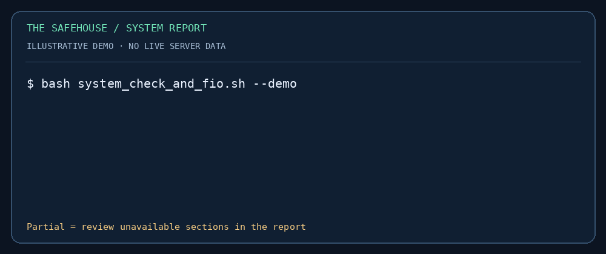

# Linux System Report

**A clear system snapshot for SOC handovers, server reviews and troubleshooting.** Collect Linux hardware and account information, review SSH MFA configuration hints, and optionally measure disk I/O with FIO.



*Animated illustration using synthetic data—not live telemetry. [View the still image](assets/demo-still.png) if you prefer no animation.*

[Quick start](#quick-start) · [Disk benchmark](#optional-disk-benchmark) · [Report formats](#report-formats) · [Troubleshooting](#troubleshooting)

## What you get

| Area | Evidence collected |
| --- | --- |
| Hardware | CPU, memory, block devices and mounted filesystem usage |
| Accounts | Users selected by UID, password aging, account status and group inventory |
| SSH configuration | Known MFA module references, with an explicit manual-review status |
| Optional FIO | Separate random-read and random-write results, with retained raw JSON |
| Report | Responsive HTML with expandable sections, plus matching TXT, CSV and JSON |

This is a point-in-time inspection tool. It does not continuously monitor a host or certify its security posture.

## Quick start

Requires **Linux, Bash and Python 3.10+**. Standard inventory commands are `lscpu`, `free`, `lsblk`, `df`, `getent`, `chage` and `passwd`. Missing commands or insufficient permissions appear as **unavailable**, rather than empty successful results. No Python packages or `jq` are required at runtime.

```bash
git clone https://github.com/amitambekar510/system-report-script.git
cd system-report-script
bash system_check_and_fio.sh
```

Open `system_report.html` in the unique directory printed at completion. Reports are saved under `./system_reports/` by default. To choose another parent:

```bash
bash system_check_and_fio.sh --output-dir ./reports
```

Start without `sudo`. Use approved elevated access only when you need restricted account evidence. Reports contain host and account information; each run directory is private to the invoking user, and files are created with restrictive permissions.

### Try the report with no host inspection

```bash
bash system_check_and_fio.sh --demo
```

This renders the bundled [synthetic sample](examples/demo.json). It performs no inventory commands or disk benchmark. The sample deliberately includes an unavailable account section to demonstrate the **partial** report state.

## Optional disk benchmark

Benchmarking is **off by default**. Install the **Flexible I/O Tester** using your distribution's package manager; consult the [official FIO documentation](https://fio.readthedocs.io/en/latest/fio_doc.html). Other programs can also use the command name `fio`; the script checks its version prefix.

```bash
# Choose an existing directory on the filesystem you intend to measure.
bash system_check_and_fio.sh --benchmark --fio-dir /path/to/test-directory
```

Defaults: two sequential tests, 10 seconds each, one 256 MiB temporary file, 4 KiB blocks, one job, synchronous I/O at depth 1, direct I/O enabled. Random-read preparation can also write the test file. Allow extra time for file preparation. Run during an approved maintenance window because benchmarking adds disk load.

```bash
bash system_check_and_fio.sh --benchmark --fio-dir /path/to/test-directory \
  --runtime 15 --size-mib 512 --output-dir ./reports
```

The tool uses a private temporary subdirectory and cleans it on normal completion or handled failure. It never accepts a raw block-device target. A forced kill or power loss can leave its `system-report-fio-*` directory behind; review ownership and contents before removing it. Insufficient free space, unavailable direct I/O or failed FIO jobs are reported as failures, not zero-performance measurements.

These measurements describe the selected filesystem and workload; they are not a general disk rating. Keep settings and environment consistent when comparing results.

## Report formats

| File | Contents |
| --- | --- |
| `system_report.html` | Offline report with readable status counts, expandable evidence and local download links |
| `system_report.txt` | System evidence and benchmark summaries |
| `system_report.csv` | Quoted category/key/status/value rows; formula-like cells are prefixed for spreadsheet safety |
| `system_report.json` | Full structured report, metadata and collection status |
| `random_read.json` / `random_write.json` | Separate raw FIO responses when those tests run |

A fresh run creates a new directory, preventing overwrites between runs. HTML escapes collected text and loads no external assets or scripts. JSON preserves original values; the CSV spreadsheet prefix is an export precaution.

## Interpreting the results

- **Complete:** inventory commands succeeded. This does not mean the host is secure.
- **Partial:** one or more inventory sections were unavailable; available evidence is retained. Exit code remains `0` so ordinary non-root collection can finish.
- **Failed:** requested benchmark or report generation failed. Exit code is `1`; completed inventory is retained when possible.
- **Invalid arguments:** exit code `2` with usage guidance.

The SSH hint inspects known module references in `/etc/pam.d/sshd`. It does **not** infer whether MFA is enabled or disabled: PAM includes, SSH `Match` rules, alternative providers and authentication paths require manual review. User selection uses the UID range 1000–65533 as a heuristic; it is not a definitive list of human accounts.

## Troubleshooting

| Symptom | Next step |
| --- | --- |
| Python not found | Install Python 3.10+ using your distribution package manager |
| Account sections unavailable | Check permissions for `chage` and `passwd`; do not treat unavailable as compliant |
| `fio` version rejected | Install Flexible I/O Tester, not another package with the same executable name |
| Benchmark failed | Check retained raw JSON, free space, filesystem direct-I/O support and target permissions |
| Report links fail after moving HTML | Keep TXT, CSV and JSON beside the HTML file |
| Older instructions mention `/tmp/system_reports` | The new default is `./system_reports`; use `--output-dir` to choose a location |

## Development

The Bash entry point delegates to Python's standard library for structured collection, reliable escaping and report generation. Keep both files when distributing the tool.

```bash
bash -n system_check_and_fio.sh
python3 -m unittest discover -s tests -v
```

CI runs these checks on Ubuntu. Benchmark tests use simulated FIO responses; they do not generate disk load. Desktop rendering and real hardware performance require validation in your own environment.

To rebuild the animated illustration and still fallback, install Pillow in a development environment and run `python3 scripts/build_demo.py`. DejaVu Sans Mono is required by the asset generator. Pillow is not needed to generate system reports.

**Amit Ambekar** · [Portfolio](https://portfolio.thesafehouse.in) · [The Safehouse](https://www.thesafehouse.in)
